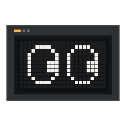
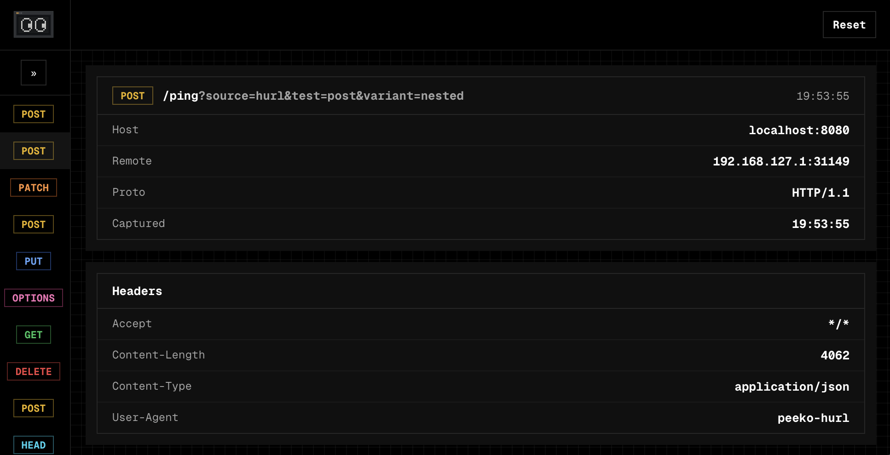
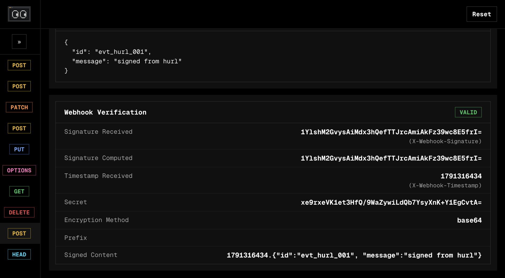

<p align="center">
  
</p>

<h1 align="center">Peeko</h1>

<p align="center">
  Peeko is a self-hosted webhook inspector — a tiny Go HTTP server that captures inbound requests and lets you inspect their headers, body, and HMAC signature verification through a built-in web UI.
</p>

## Run Your Own

```yaml
services:
  peeko:
    image: geloop/peeko
    ports:
      - "8080:8080"
    environment:
      WEBHOOK_SECRET: # optional
      WEBHOOK_SIGNATURE_HEADER: # optional
      WEBHOOK_TIMESTAMP_HEADER: # optional
      WEBHOOK_SIGNATURE_ENCODING: # optional
      WEBHOOK_SIGNATURE_PREFIX: # optional
      WEBHOOK_TOLERANCE: # optional
```

<p>
  
</p>

## Features

- Catches **all request types** - `GET`, `POST`, `PUT`, `PATCH`, `DELETE`, `HEAD` and `OPTIONS`
- Auto-refreshing **requests**
- Inspect request **method**, **path**, **raw query**, **host**, **remote address**, **protocol**, and **capture time**
- Inspect **headers**
- Inspect **query parameters**
- Inspect **payload**
- Inspect **webhook verification status** - `valid`, `invalid`, `expired`, `missing`, `skipped`

#### Webhook Validation

**Peeko** supports validating webhook signatures via **HMAC-SHA256.** 

Validation is disabled when `WEBHOOK_SECRET` is **empty**. 

When enabled, **Peeko** signs `<timestamp>.<body>` (or just `<body>` when no **timestamp header** is configured) and compares it against the **signature header.**

| Variable | Required | Description |
| --- | --- | --- |
| `WEBHOOK_SECRET` | No | **HMAC secret** for verification. **Empty** disables verification (`skipped`). |
| `WEBHOOK_SIGNATURE_HEADER` | No | Name of the **header carrying the signature**. Only used when `WEBHOOK_SECRET` is set. |
| `WEBHOOK_TIMESTAMP_HEADER` | No | **Header** carrying the **Unix-seconds timestamp.**<br/>Only used when `WEBHOOK_SECRET` is set. |
| `WEBHOOK_SIGNATURE_ENCODING` | No | The **HMAC encoding** either `hex` or `base64`.<br/>Only used when `WEBHOOK_SECRET` is set. |
| `WEBHOOK_SIGNATURE_PREFIX` | No | **Prefix stripped** before comparing signatures.<br/>Only used when `WEBHOOK_SECRET` is set. |
| `WEBHOOK_TOLERANCE` | No | **Max timestamp clock diff in milliseconds**<br/>*(30,000ms = 5 minutes)*<br/>Requests outside this window are marked `expired`.<br/>Only used when `WEBHOOK_SECRET` and timestamp header are set. |

<p>
  
</p>

## License

**Peeko** is open source under the [**MIT License**](LICENSE).


